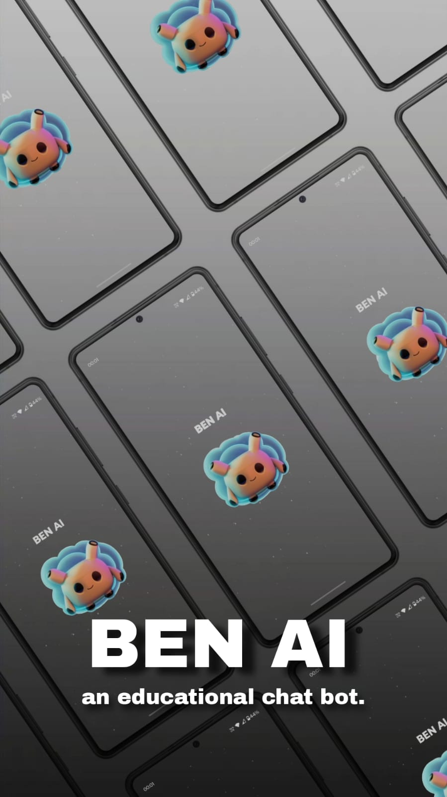

# Ben AI - Your Personal Learning Chatbot

<section style="display:flex; gap:20px;flex-wrap:wrap;">

</section>

## Overview
**Ben AI** is an innovative educational chatbot designed to be your go-to resource for learning and exploration. Leveraging advanced AI technologies, Ben AI offers personalized interactions, providing accurate answers, explanations, and insights across a broad spectrum of topics. Whether you’re a student looking to clarify complex concepts, an educator seeking a teaching aid, or a lifelong learner eager to expand your knowledge, Ben AI is tailored to meet your educational needs.

The app is built with a focus on accessibility, ensuring that learning is just a conversation away. With a clean, user-friendly interface and features like search history tracking, Ben AI not only answers your immediate questions but also helps you keep track of your learning journey. By filtering out offensive content, it also maintains a safe and respectful environment for users of all ages.

Ben AI is your personal learning companion, available anytime, anywhere, making education more interactive, engaging, and convenient. The app is designed to adapt to your learning style, offering explanations and insights that match your pace and preferences. From academic queries to general knowledge, Ben AI is here to support your curiosity and enhance your learning experience.

**Note:** <ins>Ben AI has usage limits based on the OpenAI API constraints. Users may experience limitations on the number of queries or interactions based on the current API plan. Please be mindful of these limits to ensure smooth and efficient use of the app.</ins>

## Features
- **Interactive Learning**: Engage in meaningful conversations on a variety of topics.
- **Search History**: Keep track of your past queries for easy reference.
- **Safe and Respectful**: Offensive content is filtered to ensure a positive learning experience.
- **Accessible Knowledge**: Explore information anytime, anywhere with just a tap.

## Installation

1. Download the APK file.

2. Install the APK on your Android device.

3. Open the app and start exploring with Ben AI!

## Usage
- **Ask Questions**: Type in any question or topic you're curious about, and Ben AI will provide detailed and accurate responses.
- **Explore Topics**: Dive into different subjects by continuing the conversation with Ben AI.
- **View Search History**: Access your past queries to revisit previous discussions and learnings.

## License
This project is licensed under the MIT License - see the [LICENSE](LICENSE) file for details.

## Contact
For any inquiries or support, please contact me.

## Acknowledgements
- [OpenAI](https://openai.com/) for the AI technology powering the chatbot.
- Any other libraries or tools you used in the project.
